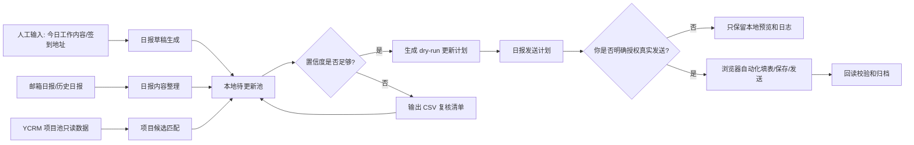
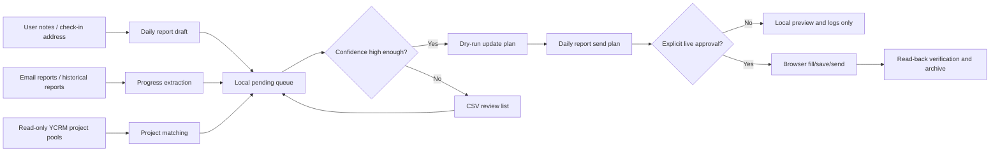

# Yealink YCRM Daily Report Automation

## 中文说明

这个仓库用于备份和复用 YCRM 日报相关的安全自动化流程。它的目标很简单：把“写日报、整理签到记录、参考历史日报风格、准备发送”这些重复工作变成可检查、可追踪、可交给 Agent 执行的流程。

它适合三类日常场景：

- 你给出今天的大致工作内容，系统按日报模板生成目标、实际完成情况和待跟进事项。
- 系统从邮箱或历史日报中整理同事的项目进展，先形成本地待更新池和复核 CSV。
- 当日报内容已经确认后，系统生成安全发送计划；真实点击保存/发送默认关闭，只能在你明确授权后执行。

公开备份版本只保存脱敏脚本、模板、流程说明和示例数据。它不包含真实客户名称、真实日报、账号密码、浏览器登录态、cookie、截图、HAR 或原始导出。

### 能提升什么效率

- 少手写：把散乱的拜访记录、会议记录、项目进展整理成统一日报格式。
- 少漏项：发送前检查日报编号、日期、签到记录、必填字段和待跟进事项。
- 少重复：同一天、同 owner、同客户的重复签到可以合并为一条日报草稿。
- 易复核：低置信度匹配不会直接写 YCRM，而是进入 CSV 或本地待更新池。
- 可追踪：每次准备写入或发送前都会生成本地计划和预览，方便回看。

### 流程拓扑图



### 安全边界

- 默认只做本地 artifact、CSV、dry-run、只读读取和预览。
- 真实 YCRM 保存/发送必须同时满足：
  - 当前 Codex 对话中有明确授权。
  - 环境变量 `YCRM_DAILY_REPORT_LIVE_SEND=1` 已设置。
  - 发送计划里的 `liveSendGate.liveSendEnabled` 为 `true`。
- 任何凭证只允许通过本地环境变量或本机浏览器登录态读取，不写入仓库。

### 常用命令

```powershell
npm install
npx playwright install chromium

# 抓取授权范围内的日报样例
npm run fetch

# 分析历史日报写法
npm run analyze

# 根据输入生成安全发送计划，默认不会写入或发送
npm run plan -- examples/daily_report_send_input.example.json work/daily_report_send
```

### 输入示例

见 `examples/daily_report_send_input.example.json`。字段含义：

- `reportUrl` / `reportId`: YCRM 日报详情页或日报 ID。
- `reportNo`: YCRM 日报编号，用于发送前复核。
- `reportDate`: 日报日期。
- `sendGroup`: 发送群组，默认可使用 `vcs.cn.trip@yealink.com`。
- `participants`: 与会人员。
- `target`: 今日目标。
- `actual`: 实际完成情况。
- `follow`: 待跟进事项。

### 给 Agent 的使用提示

把这个仓库作为日报自动化能力说明交给 Agent。Agent 应该先生成本地计划和预览，不要直接点击保存或发送。只有当用户在当前对话明确要求发送，并且安全开关打开时，才允许运行真实发送模板。

## English

This repository backs up a safe YCRM daily-report workflow for Yealink users. Its purpose is practical: help an agent turn rough work notes, check-in records, historical report style, and project progress into consistent daily-report drafts and reviewable local plans.

It supports three common workflows:

- You provide today's rough work notes, and the workflow drafts the report target, actual progress, and follow-up items.
- The workflow summarizes email or historical daily reports into a local pending-update queue and CSV review files.
- After the draft is confirmed, the workflow builds a safe send plan. Real save/send actions are locked by default and require explicit approval.

The public backup contains only sanitized scripts, templates, workflow notes, and sample data. It does not include real customers, real reports, credentials, browser profiles, cookies, screenshots, HAR files, or raw exports.

### Business Value

- Less manual writing: convert scattered notes into a consistent daily-report format.
- Fewer missing fields: check report identity, date, required fields, and follow-ups before sending.
- Less duplicate work: merge repeated check-ins from the same day, owner, and customer.
- Easier review: low-confidence matches go to CSV or a local pending queue instead of direct YCRM writes.
- Better traceability: every update or send attempt starts from a local plan and preview.

### Workflow Topology



### Safety Model

- Default mode allows only local artifacts, CSV review files, dry-run plans, read-only browser previews, and validation.
- Real YCRM save/send requires all of the following:
  - Explicit approval in the active Codex thread.
  - `YCRM_DAILY_REPORT_LIVE_SEND=1`.
  - `liveSendGate.liveSendEnabled=true` in the send plan.
- Credentials must stay in local environment variables or local browser state. They must not be committed.

### Quick Start

```powershell
npm install
npx playwright install chromium
npm run fetch
npm run analyze
npm run plan -- examples/daily_report_send_input.example.json work/daily_report_send
```

### License

MIT License.
